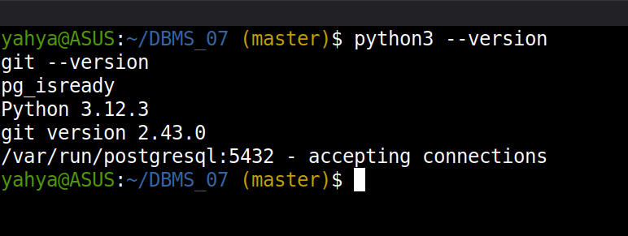
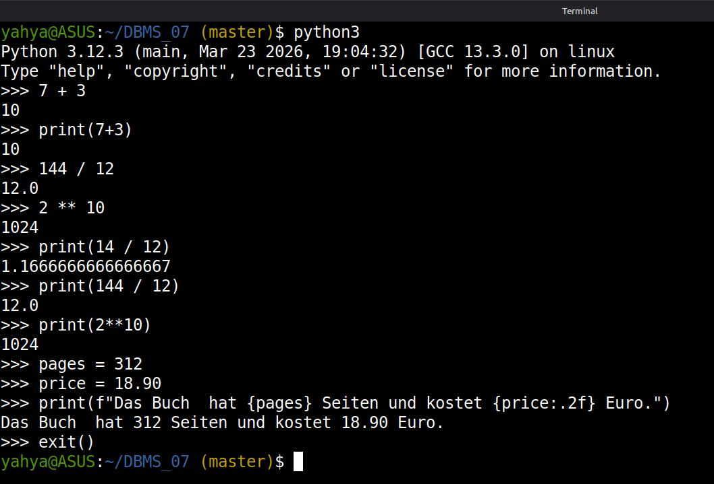
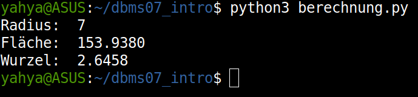
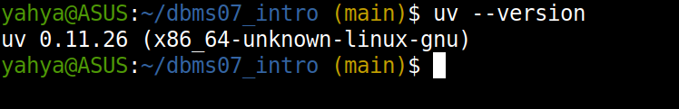
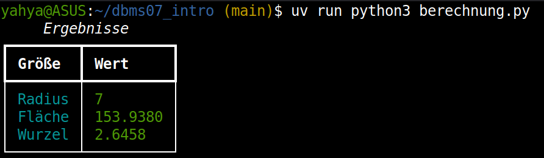
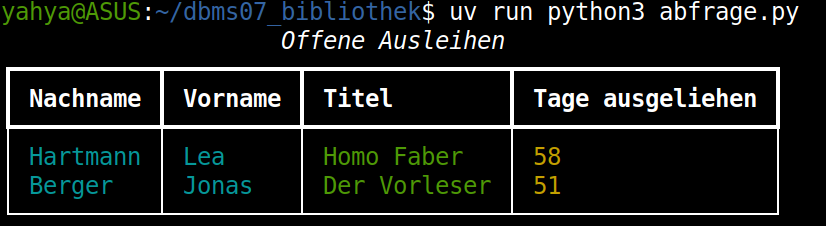
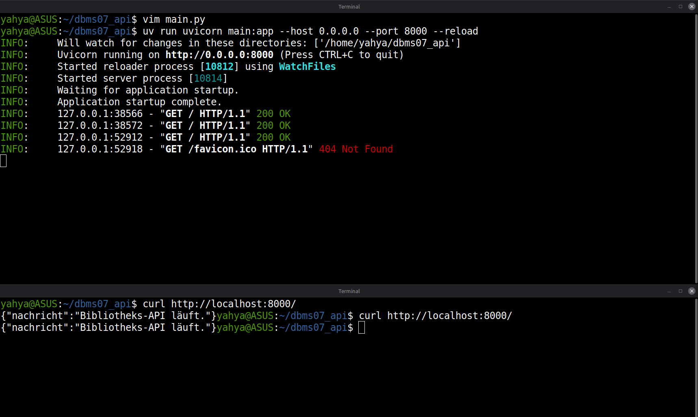
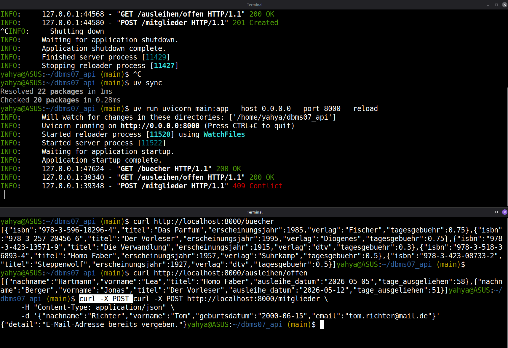

# DBMS_07 – From Database to API: Python, psycopg2, and FastAPI

**Module:** Databases · THGA Bochum  
**Lecturer:** Stephan Bökelmann · <sboekelmann@ep1.rub.de>  
**Repository:** <https://github.com/MaxClerkwell/DBMS_07>  
**Prerequisites:** DBMS_01 – DBMS_06, Lecture 07  
**Duration:** 120 minutes

---

## Learning Objectives

After completing this exercise you will be able to:

- Use the **Python REPL** for interactive arithmetic and string formatting
- Import a **standard library module** and call functions through its namespace
- Write a Python **script file**, run it from the terminal, and protect
  top-level code with `if __name__ == "__main__"`
- Explain the role of a **shebang line** and file permissions
- Distinguish between standard library modules and **third-party packages**,
  and explain why system-wide `pip install` is problematic
- Set up a **virtual environment** with `uv`, declare dependencies in
  `pyproject.toml`, and run a project with `uv run`
- Connect to a **PostgreSQL database** from Python using `psycopg2` and
  execute SQL queries programmatically
- Build a minimal **FastAPI** application with multiple endpoints that expose
  database data over HTTP
- Explain why a REST API is a useful **abstraction layer** over a database

**After completing this exercise you should be able to answer the following questions independently:**

- What is the difference between the Python REPL and running a script?
- Why should third-party packages not be installed system-wide with `pip`?
- What does `uv sync` do, and why is `uv run` preferable to activating a
  virtual environment manually?
- What does a database cursor do in `psycopg2`?
- Why can a FastAPI endpoint hide the complexity of a database query from
  its caller?

---

## Prerequisites Check

You need Python 3, Git, and a running PostgreSQL server with the `bibliothek`
database from DBMS_06.

```bash
python3 --version
git --version
pg_isready
```

> All three commands should succeed. If `pg_isready` fails, start PostgreSQL:
>
> ```bash
> sudo systemctl start postgresql
> ```

> **Screenshot 1:** Take a screenshot showing all three version/status checks.
>
> 


---

## 1 – The Python REPL

The Python **Read-Eval-Print Loop** (REPL) is an interactive shell that
evaluates one expression at a time and immediately prints the result. It is
the fastest way to experiment with language features.

Start the REPL:

```bash
python3
```

You should see the `>>>` prompt. Type each line individually and press Enter:

```python
>>> 7 + 3
>>> 144 / 12
>>> 2 ** 10
```

Now use `print` explicitly:

```python
>>> print(7 + 3)
>>> print(144 / 12)
>>> print(2 ** 10)
```

> Observe the difference: without `print`, the REPL shows a *representation*
> of the value. With `print`, the value is written to standard output — the
> same way it would appear in a script.

Now use an **f-string** to embed a value in a sentence:

```python
>>> pages = 312
>>> price = 18.90
>>> print(f"Das Buch hat {pages} Seiten und kostet {price:.2f} Euro.")
```

Exit the REPL:

```python
>>> exit()
```

> **Screenshot 2:** Take a screenshot showing all REPL interactions above,
> including the f-string output.
>
> 

### Questions for Section 1

**Question 1.1:** In the REPL, typing `2 ** 10` without `print` still shows
`1024`. Why does this work in the REPL but *not* in a script file?

> It's because the REPL is like a calculator: after every line, it shows you the answer automatically.
> Whereas a script file is differnet, in that Python just runs the code and will only output to the screem after
> calling the print() function.

**Question 1.2:** The f-string format specifier `:.2f` controls how `price`
is displayed. What does it mean, and what would `:.4f` produce for `18.9`?

> `.2f` literally means: show the number as a fixed-point decimal with 2 digits after the decimal point, hence .2f
> `.4f` on `18.9` would output `18.9000` 

---

## 2 – Importing a Standard Library Module

Python ships with a large **standard library** — modules that are always
available without installation. You import a module by name and call its
functions using the `module.function()` notation.

Start the REPL again:

```bash
python3
```

Import the `math` module and use several of its functions:

```python
>>> import math
>>> math.sqrt(144)
>>> math.floor(3.7)
>>> math.ceil(3.2)
>>> math.pi
>>> print(f"Der Umfang eines Kreises mit r=5 beträgt {2 * math.pi * 5:.4f}")
```

> Notice that you always write `math.` before the function name. This
> **namespace prefix** makes it immediately clear where the function comes
> from and avoids name collisions — a function called `sqrt` defined elsewhere
> in your code would not interfere with `math.sqrt`.

Exit the REPL:

```python
>>> exit()
```

### Questions for Section 2

**Question 2.1:** Python also allows `from math import sqrt`, after which you
can write `sqrt(144)` without the `math.` prefix. What is the drawback of
this style compared to `import math`?

> Indicating the module of a function is better, since names can clash and readers can't tell which module `sqrt` belongs to.

**Question 2.2:** The standard library is always available — it requires no
installation. Name two other standard library modules (not `math`) and
describe in one sentence what each one is used for.

> `os`: most famous one, it interacts with the operating system (file paths, directories...)
> `sys`: it accesses interpreter-level stuff like command line arguments and exiting the program

---

## 3 – A Python Script File

Interactive work in the REPL does not persist. For reproducible work you write
code in a file and run it with the Python interpreter.

### Step 1 – Create the Project Directory and Git Repository

```bash
mkdir ~/dbms07_intro
cd ~/dbms07_intro
git init
```

Add a remote. Replace the URL with your own repository on GitHub or GitLab:

```bash
git remote add origin git@github.com:<your-username>/dbms07_intro.git
```

### Step 2 – Write the Script

```bash
vim berechnung.py
```

Enter the following content:

```python
import math

def kreisflaeche(r):
    return math.pi * r ** 2

def main():
    radius = 7
    flaeche = kreisflaeche(radius)
    print(f"Radius:  {radius}")
    print(f"Fläche:  {flaeche:.4f}")
    print(f"Wurzel:  {math.sqrt(radius):.4f}")

if __name__ == "__main__":
    main()
```

Save and exit: `Esc`, `:wq`, Enter.

### Step 3 – Run the Script

```bash
python3 berechnung.py
```

> You should see three lines of output.

> **Screenshot 3:** Take a screenshot showing the terminal output of
> `python3 berechnung.py`.
>
> 

### Step 4 – Commit

```bash
git add berechnung.py
git commit -m "feat: initial calculation script"
git push -u origin main
```

### Questions for Section 3

**Question 3.1:** The script wraps its logic in a `main()` function and calls
it only under `if __name__ == "__main__"`. What is `__name__` set to when the
file is run directly? What is it set to when the file is *imported* by another
module — and why does this distinction matter?

> Run directly: `__name__` is `"__main__"`
> Imported: `__name__` is the module's filename
> This matters because it lets you reuse functions from the file without triggering `main()`

**Question 3.2:** The `kreisflaeche` function could be defined without
importing `math` by hard-coding `3.14159` instead of `math.pi`. Give one
concrete reason why using `math.pi` is preferable.

> Precision: results are more accurate that way

---

## 3.1 – Shebang and File Permissions

Currently you must type `python3 berechnung.py` to run the script. A
**shebang line** as the very first line of a script tells the operating system
which interpreter to use, so you can run the file directly.

Open the file:

```bash
vim berechnung.py
```

Add this as the **first line**, before `import math`:

```python
#!/usr/bin/env python3
```

Save and exit. Now make the file executable:

```bash
chmod +x berechnung.py
```

Run it directly:

```bash
./berechnung.py
```

> The output should be identical to before.

**What `chmod +x` does:**  
Every file on a Linux system has three permission bits for each of three
categories (owner, group, others): **r**ead, **w**rite, e**x**ecute.
`chmod +x` sets the execute bit for all categories. Without it, the kernel
refuses to run the file as a program even if a shebang is present. You can
inspect permissions with:

```bash
ls -l berechnung.py
```

> The output should start with `-rwxr-xr-x` (the `x` bits are set).

**Why `#!/usr/bin/env python3` and not `#!/usr/bin/python3` directly?**  
`/usr/bin/env python3` searches the current `PATH` for the `python3`
executable at run time. This is important when you later use a virtual
environment: the `python3` in your environment takes precedence over the
system one, and the shebang still works correctly.

Commit:

```bash
git add berechnung.py
git commit -m "feat: add shebang and make script executable"
git push
```

---

## 4 – Third-Party Libraries and Why Not to Use pip Directly

Python's standard library is powerful, but many tasks require **third-party
packages** — code written and published by the community on the Python Package
Index (PyPI).

Start the REPL and try to import `rich`, a library for colourful terminal output:

```bash
python3
```

```python
>>> import rich
```

> You should see:
> ```
> ModuleNotFoundError: No module named 'rich'
> ```

`rich` is not part of the standard library. It must be installed. The
standard tool for this is **pip**, Python's package installer:

```bash
pip install rich        # DO NOT run this
```

> **Do not run this command.** When you install a package with `pip` outside
> a virtual environment, it lands in your system-wide Python installation —
> the same one used by the operating system and every other Python program
> on the machine. This causes three problems:
>
> 1. **Version conflicts:** Project A needs `rich==12.0`, Project B needs
>    `rich==13.0`. Only one can be installed system-wide.
> 2. **No reproducibility:** There is no record of what was installed or why.
>    Another machine (or the same machine after an OS upgrade) will behave
>    differently.
> 3. **System integrity:** Some Linux distributions manage Python packages
>    through their own package manager (`apt`). Installing packages with `pip`
>    can overwrite system-managed files and break tools the OS relies on.
>
> The correct solution is a **virtual environment** — an isolated Python
> installation per project. We will use `uv` to manage this.

Exit the REPL:

```python
>>> exit()
```

---

## 4.1 – Installing uv

`uv` is a fast Python package manager and project tool written in Rust. It
creates and manages virtual environments, resolves dependencies, and runs
scripts — all without touching the system Python.

The official installation method downloads a shell script from the internet
and pipes it directly into `bash`:

```bash
curl -LsSf https://astral.sh/uv/install.sh | bash
```

> **Stop and think before running this.**
> Piping a downloaded script into `bash` gives it full access to your system.
> This is a common installation pattern, but it carries real risk: if the
> download server is compromised, or if you are on an untrusted network, the
> script you execute may not be the one you expect.
>
> Before running such a command in a production or shared environment, the
> safe practice is to:
> 1. Download the script first: `curl -LsSf https://astral.sh/uv/install.sh -o install.sh`
> 2. Read it: `less install.sh`
> 3. Only then execute it: `bash install.sh`
>
> For this exercise on the lecture server or a personal machine, the direct
> pipe form is acceptable. Develop the habit of pausing anyway.

After installation, reload your shell environment:

```bash
source ~/.bashrc
```

Verify:

```bash
uv --version
```

> **Screenshot 4:** Take a screenshot showing the `uv --version` output.
>
> 

---

## 4.2 – A Project with uv and rich

### Step 1 – Create pyproject.toml

Stay in `~/dbms07_intro`. Create the project configuration file:

```bash
vim pyproject.toml
```

Enter the following content:

```toml
[project]
name = "dbms07-intro"
version = "0.1.0"
requires-python = ">=3.11"
dependencies = [
    "rich",
]
```

Save and exit.

### Step 2 – Install Dependencies

```bash
uv sync
```

> `uv sync` reads `pyproject.toml`, creates a virtual environment in `.venv/`,
> resolves all dependencies, and installs them — without touching your system
> Python. It also writes a `uv.lock` file that pins the exact versions of
> every installed package so that anyone running `uv sync` from the same
> lockfile gets an identical environment.

### Step 3 – Use rich in the Script

Open `berechnung.py` and add a colourful output section. Replace the `main`
function with:

```python
from rich.console import Console
from rich.table import Table

def main():
    console = Console()
    radius = 7
    flaeche = kreisflaeche(radius)

    table = Table(title="Ergebnisse")
    table.add_column("Größe", style="cyan")
    table.add_column("Wert", style="green")
    table.add_row("Radius",  str(radius))
    table.add_row("Fläche",  f"{flaeche:.4f}")
    table.add_row("Wurzel",  f"{math.sqrt(radius):.4f}")

    console.print(table)
```

### Step 4 – Run with uv

```bash
uv run python3 berechnung.py
```

> `uv run` executes the command inside the project's virtual environment.
> You never need to activate the environment manually with `source .venv/bin/activate`.

> **Screenshot 5:** Take a screenshot showing the colourful table output
> from `uv run`.
>
> 

### Step 5 – Commit

```bash
git add pyproject.toml uv.lock berechnung.py
git commit -m "feat: add rich dependency and colourful table output"
git push
```

### Questions for Section 4

**Question 4.1:** `uv sync` creates a `uv.lock` file in addition to
`pyproject.toml`. What is the difference between the two files? Why should
`uv.lock` be committed to version control while generated files like `.venv/`
should not?

> `pyproject.toml` describes what you want
> `uv.lock` is exactly wha got installed
> `uv.lock` should be commited so that everyone gets the same environment.
> `.venv/` shouldn't: it's just a loval folder containing installed files. 

**Question 4.2:** `uv run python3 berechnung.py` uses the virtual
environment's Python. What would happen if you ran `python3 berechnung.py`
directly (without `uv run`) and `rich` is not installed system-wide?

> Error: `ModuleNotFoundError: No module named 'rich'`
> Python has no access to the vitual environemnt where `rich` is installed

---

## 5 – Connecting to PostgreSQL from Python

You will now create a **new project** to query the `bibliothek` database from
DBMS_06 programmatically.

### Step 1 – Create the Project

Create the directory and files manually — without using `uv init`:

```bash
mkdir ~/dbms07_bibliothek
cd ~/dbms07_bibliothek
git init
git remote add origin git@github.com:<your-username>/dbms07_bibliothek.git
```

Create `pyproject.toml`:

```bash
vim pyproject.toml
```

```toml
[project]
name = "dbms07-bibliothek"
version = "0.1.0"
requires-python = ">=3.11"
dependencies = [
    "psycopg2-binary",
    "rich",
]
```

Install dependencies:

```bash
uv sync
```

### Step 2 – Write the Query Script

```bash
vim abfrage.py
```

```python
#!/usr/bin/env python3

import psycopg2
from rich.console import Console
from rich.table import Table

DB_CONFIG = {
    "dbname":   "bibliothek",
    "user":     "<your-username>",
    "password": "<your-password>",
    "host":     "localhost",
    "port":     5432,
}

def offene_ausleihen(cursor):
    cursor.execute("""
        SELECT m.nachname,
               m.vorname,
               b.titel,
               CURRENT_DATE - a.ausleihe_datum AS tage_ausgeliehen
        FROM   ausleihe  a
        JOIN   exemplar  e ON e.exemplar_id = a.exemplar_id
        JOIN   buch      b ON b.isbn        = e.isbn
        JOIN   mitglied  m ON m.mitglied_id = a.mitglied_id
        WHERE  a.rueckgabe_datum IS NULL
        ORDER BY tage_ausgeliehen DESC
    """)
    return cursor.fetchall()

def main():
    console = Console()

    conn   = psycopg2.connect(**DB_CONFIG)
    cursor = conn.cursor()

    rows = offene_ausleihen(cursor)

    table = Table(title="Offene Ausleihen")
    table.add_column("Nachname",          style="cyan")
    table.add_column("Vorname",           style="cyan")
    table.add_column("Titel",             style="green")
    table.add_column("Tage ausgeliehen",  style="yellow")

    for row in rows:
        table.add_row(row[0], row[1], row[2], str(row[3]))

    console.print(table)

    cursor.close()
    conn.close()

if __name__ == "__main__":
    main()
```

### Step 3 – Run the Script

```bash
uv run python3 abfrage.py
```

> You should see a colourful table of open loans from the `bibliothek`
> database.

> **Screenshot 6:** Take a screenshot showing the query result table.
>
> 

### Step 4 – Commit

```bash
git add pyproject.toml uv.lock abfrage.py
git commit -m "feat: query open loans from bibliothek via psycopg2"
git push
```

### Questions for Section 5

**Question 5.1:** The script uses a **cursor** object to execute the SQL
query. What is the role of a cursor in the database connection model?
Why is one connection able to hold multiple cursors simultaneously?

> A cursor executes SQL statements and manages the resulting rows (fone-by-one fetch).
> One connection can hold multiple cursors because each cursor tracks its own query and
> result set independently

**Question 5.2:** The connection parameters (username, password, host) are
written directly in the script as `DB_CONFIG`. Why is this a security problem
in a real project? Name one common alternative for storing credentials outside
the source code.

> Hardcoding credentials means they get committed to Git which means
> it would be visible in the repo's history to anyone with access
> An Altenrative would be environment variables 

**Question 5.3:** `cursor.fetchall()` returns a list of tuples. The script
accesses `row[0]`, `row[1]`, etc. by index. What is the risk of this approach,
and which `psycopg2` cursor subclass would return named columns instead?

> Risk is that indexing by position is fragile, in other words if the column order in the `SELECT` changes, the `row` elements would silently point ot the wrong data instead of flagging an error.
> The fix would be to use `psycopg2.extras.RealDictCursor` 

---

## 6 – A Minimal FastAPI Application

A Python script that queries a database is useful, but it only runs on one
machine and cannot be called by other programs. A **REST API** solves this:
it wraps database logic behind HTTP endpoints that any client — a browser,
`curl`, another service — can call.

### Step 1 – Create the Project

```bash
mkdir ~/dbms07_api
cd ~/dbms07_api
git init
git remote add origin git@github.com:<your-username>/dbms07_api.git
```

```bash
vim pyproject.toml
```

```toml
[project]
name = "dbms07-api"
version = "0.1.0"
requires-python = ">=3.11"
dependencies = [
    "fastapi",
    "uvicorn[standard]",
]
```

```bash
uv sync
```

### Step 2 – Write the Application

```bash
vim main.py
```

```python
#!/usr/bin/env python3

from fastapi import FastAPI

app = FastAPI()

@app.get("/")
def root():
    return {"nachricht": "Bibliotheks-API läuft."}
```

### Step 3 – Start the Server

```bash
uv run uvicorn main:app --host 0.0.0.0 --port 8000 --reload
```

> `uvicorn` is an ASGI web server. `main:app` tells it to look for the
> object named `app` in the file `main.py`. `--reload` restarts the server
> automatically when you save a change.

Open a **second terminal** (or SSH session) and test the endpoint:

```bash
curl http://localhost:8000/
```

> Expected response:
> ```json
> {"nachricht":"Bibliotheks-API läuft."}
> ```

You can also open `http://localhost:8000/docs` in a browser to see the
automatically generated interactive API documentation that FastAPI creates
from your code.

> **A note on network exposure:**  
> The flag `--host 0.0.0.0` makes the server listen on all network interfaces,
> not just `localhost`. If the machine running this server has a public IP
> address and port 8000 is not blocked by a firewall, anyone on the internet
> can reach your API. On the lecture server, other participants in the room
> can access it using your server's IP. This is intentional for development
> and testing, but in production an API must sit behind a firewall or a
> reverse proxy (nginx, Caddy) and use HTTPS.

> **Screenshot 7:** Take a screenshot showing the `curl` response and the
> uvicorn startup log in the other terminal.
>
> 

### Step 4 – Commit

Stop the server with `Ctrl+C`, then:

```bash
git add pyproject.toml uv.lock main.py
git commit -m "feat: minimal FastAPI application with root endpoint"
git push
```

### Questions for Section 6

**Question 6.1:** FastAPI generates interactive documentation at `/docs`
automatically. What standard does it use to describe the API, and what
advantage does machine-readable API documentation have over a PDF?

> FastAPI uses the OpenAPI standard.
> a PDF is just static text a human has to read and manually translate into code, with no guarantee it matches the actual implementation.

**Question 6.2:** The `--reload` flag is useful during development but should
not be used in production. Why?

> `--reload` watches source files and restarts the server on every change. Which adds overhead
> and can interrupt request when a restart happens. Productions needs a server that stays up and reliable.

---

## 7 – Wiring the Database into FastAPI

You now have all the pieces: a PostgreSQL database, a Python database
connector, and a running FastAPI application. This section connects them.

### Step 1 – Add the Database Dependency

Stop the server. Add `psycopg2-binary` to `pyproject.toml`:

```toml
[project]
name = "dbms07-api"
version = "0.1.0"
requires-python = ">=3.11"
dependencies = [
    "fastapi",
    "uvicorn[standard]",
    "psycopg2-binary",
]
```

```bash
uv sync
```

### Step 2 – Extend main.py with Three Endpoints

Open `main.py` and replace its contents:

```python
#!/usr/bin/env python3

import psycopg2
import psycopg2.extras
from fastapi import FastAPI, HTTPException
from pydantic import BaseModel

app = FastAPI(title="Bibliotheks-API")

DB_CONFIG = {
    "dbname":   "bibliothek",
    "user":     "<your-username>",
    "password": "<your-password>",
    "host":     "localhost",
    "port":     5432,
}

def get_connection():
    return psycopg2.connect(**DB_CONFIG)


# ── Endpoint 1: list all books ──────────────────────────────────────────────

@app.get("/buecher")
def buecher_liste():
    conn   = get_connection()
    cursor = conn.cursor(cursor_factory=psycopg2.extras.RealDictCursor)
    cursor.execute("SELECT isbn, titel, erscheinungsjahr, verlag, tagesgebuehr FROM buch ORDER BY titel")
    rows = cursor.fetchall()
    cursor.close()
    conn.close()
    return rows


# ── Endpoint 2: open loans with member and book details ─────────────────────

@app.get("/ausleihen/offen")
def offene_ausleihen():
    conn   = get_connection()
    cursor = conn.cursor(cursor_factory=psycopg2.extras.RealDictCursor)
    cursor.execute("""
        SELECT m.nachname,
               m.vorname,
               b.titel,
               a.ausleihe_datum,
               CURRENT_DATE - a.ausleihe_datum AS tage_ausgeliehen
        FROM   ausleihe  a
        JOIN   exemplar  e ON e.exemplar_id = a.exemplar_id
        JOIN   buch      b ON b.isbn        = e.isbn
        JOIN   mitglied  m ON m.mitglied_id = a.mitglied_id
        WHERE  a.rueckgabe_datum IS NULL
        ORDER BY tage_ausgeliehen DESC
    """)
    rows = cursor.fetchall()
    cursor.close()
    conn.close()
    return rows


# ── Endpoint 3: add a new member ─────────────────────────────────────────────

class NeuesMitglied(BaseModel):
    nachname:       str
    vorname:        str
    geburtsdatum:   str   # expected format: YYYY-MM-DD
    email:          str

@app.post("/mitglieder", status_code=201)
def mitglied_anlegen(mitglied: NeuesMitglied):
    conn   = get_connection()
    cursor = conn.cursor()
    try:
        cursor.execute(
            """
            INSERT INTO mitglied (nachname, vorname, geburtsdatum, email)
            VALUES (%s, %s, %s, %s)
            RETURNING mitglied_id
            """,
            (mitglied.nachname, mitglied.vorname, mitglied.geburtsdatum, mitglied.email),
        )
        new_id = cursor.fetchone()[0]
        conn.commit()
    except psycopg2.errors.UniqueViolation:
        conn.rollback()
        raise HTTPException(status_code=409, detail="E-Mail-Adresse bereits vergeben.")
    finally:
        cursor.close()
        conn.close()
    return {"mitglied_id": new_id}
```

### Step 3 – Start the Server and Test All Endpoints

```bash
uv run uvicorn main:app --host 0.0.0.0 --port 8000 --reload
```

In a second terminal, test each endpoint:

**GET /buecher**

```bash
curl http://localhost:8000/buecher
```

**GET /ausleihen/offen**

```bash
curl http://localhost:8000/ausleihen/offen
```

**POST /mitglieder**

```bash
curl -X POST http://localhost:8000/mitglieder \
     -H "Content-Type: application/json" \
     -d '{"nachname":"Richter","vorname":"Tom","geburtsdatum":"2000-06-15","email":"tom.richter@mail.de"}'
```

> Expected response: `{"mitglied_id": 4}` (or the next available ID).

Try posting the same e-mail a second time and observe the 409 error response.

> **Screenshot 8:** Take a screenshot showing the curl output for all three
> endpoints, including the 409 error on the duplicate POST.
>
> 

### Step 4 – Commit

```bash
git add pyproject.toml uv.lock main.py
git commit -m "feat: add /buecher, /ausleihen/offen, and /mitglieder endpoints"
git push
```

### Questions for Section 7

**Question 7.1:** Endpoint 3 uses parameterized queries:
`cursor.execute("... VALUES (%s, %s, %s, %s)", (value1, ...))`.
What would be the security risk of building the SQL string by concatenation
(`"VALUES ('" + mitglied.nachname + "'...)`)? Name the attack this prevents.

> Concatenating strings directly into SQL lets user input change the structure of the query itself.
> Parameterized queries prevent this by treating input strictly as data, never as executable SQL
> `SQL injection attack`

**Question 7.2:** The `RealDictCursor` in endpoints 1 and 2 returns each row
as a dictionary instead of a tuple. Why does this make the API response more
useful to a client that receives the JSON output?

> Dict → JSON with named fields (`{"titel": ...}`), so the client reads data by name, not by guessing position.

**Question 7.3:** A caller of `GET /ausleihen/offen` receives a list of open
loans without knowing anything about the underlying table structure, join logic,
or database credentials. Name two concrete advantages this abstraction provides
compared to giving every caller direct database access.

> 1. Security
> 2. Flexibility

---

## 8 – Reflection and Outlook

**Question A – Separation of concerns:**  
The API now hides a four-table JOIN behind a single URL. A frontend developer
can call `/ausleihen/offen` without knowing SQL. What is the general software
engineering principle behind this, and where else in a typical application
stack does the same principle appear?

> Abstraction (separation of concerns, hiding implementation complexity behind a simple interface. Same principle appears in ORMs (hiding SQL from app code), frontend components (hiding rendering logic), and OS APIs (hiding hardware from applications).

**Question B – Stateless HTTP vs. database connections:**  
Each of the three endpoints opens a new database connection and closes it after
the query. In a production system with hundreds of simultaneous requests this
would be inefficient. What is the standard solution, and which Python library
provides it for `psycopg2`?

> Connection pooling. Library: psycopg2.pool (or a wrapper like SQLAlchemy with pooling, or pgbouncer at the infra level).

**Question C – Authentication:**  
The API currently has no access control — anyone who can reach the server on
port 8000 can read and write data. Two common approaches to add authentication
to a FastAPI application are **JWT tokens** (stateless, validated by the API
itself) and **Keycloak** (external identity provider, acting as middleware).
What is the main operational difference between the two approaches?

> JWT, the API validates tokens itself, no external calls needed, fully stateless. Keycloak, authentication is delegated to a separate identity server the API must trust and communicate with, adding an extra moving part but centralizing user/auth management across multiple services.

**Question D – The abstraction chain:**  
You have now built a complete chain: raw data in PostgreSQL → SQL query in
Python → JSON response from FastAPI → curl client. Describe in two sentences
what each link in this chain contributes and why removing any one of them
would make the system harder to use or maintain.

> PostgreSQL stores and enforces the structured, persistent data. The Python/SQL layer retrieves and shapes that data into meaningful results. FastAPI exposes those results as a documented, network-accessible JSON endpoint. The curl client consumes that endpoint without needing to know anything about the layers beneath it. Removing any layer forces the next one up to absorb its responsibilities, e.g. without FastAPI, every client would need direct DB access and SQL knowledge.

---

## Further Reading

- [Python – Built-in Functions](https://docs.python.org/3/library/functions.html)
- [Python – `math` module](https://docs.python.org/3/library/math.html)
- [uv – Project documentation](https://docs.astral.sh/uv/)
- [psycopg2 – Basic usage](https://www.psycopg.org/docs/usage.html)
- [FastAPI – First steps](https://fastapi.tiangolo.com/tutorial/first-steps/)
- [FastAPI – SQL (relational) databases](https://fastapi.tiangolo.com/tutorial/sql-databases/)
- Lecture 07 handout
